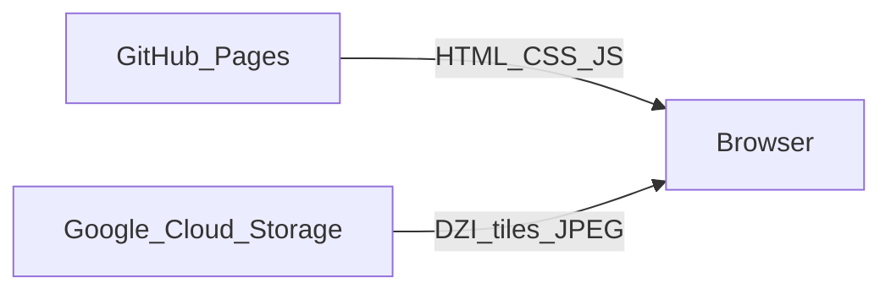

# Shroud of Turin — Deep Zoom Viewer

**Explore the Holy Shroud in your browser** with smooth deep zoom, pan, image filters, and eight high-resolution photographs—including the 2002 restoration scan, Secondo Pia (1898), Giuseppe Enrie (1931), face detail, and negative comparisons.

[](https://pedrokohler.github.io/shroud-viewer/)

## Live site

**[https://pedrokohler.github.io/shroud-viewer/](https://pedrokohler.github.io/shroud-viewer/)**

Preview image (social / Open Graph — lightweight `og-share.jpg` on Pages):


## Features

- **Deep zoom** — [OpenSeadragon](https://openseadragon.github.io/) with tiled imagery (DZI) for fast pan and zoom
- **Eight curated views** — Full-length restoration, Enrie, Pia, face detail, neg/pos comparison, negatives, and more
- **Image filters** — Brightness, contrast, saturation, invert, grayscale
- **Navigation** — Zoom buttons, home, rotation, minimap, fullscreen
- **Keyboard shortcuts** — `+`/`-` zoom, `f` fullscreen, `h` home, `s` sidebar, `n` invert, `r` / `R` rotate
- **Mobile-friendly** — On narrow screens the sidebar starts closed so the viewer fills the screen; use the menu button to open controls
- **Privacy-friendly analytics** — [GoatCounter](https://www.goatcounter.com/) (no cookies)

## Architecture



| Layer | Host | Role |
|-------|------|------|
| App shell | GitHub Pages (`pedrokohler.github.io/shroud-viewer`) | `index.html`, `styles.css`, `app.js`, `og-share.jpg` |
| Media | GCS bucket `shroud_images` | Deep-zoom tiles (`tiles/`) and gallery thumbnails (`images/`) |

## Image sources

Photographs from **[Wikimedia Commons — Shroud of Turin](https://commons.wikimedia.org/wiki/Category:Shroud_of_Turin)** (public domain / CC BY 4.0 where applicable). See the in-app About section for links.

## Local development

1. **Optional:** Regenerate the social preview image (needs `images/shroud-face-hires.jpg`):

   ```bash
   python3 scripts/build_og_share.py
   ```

2. **Optional:** Generate DZI tiles (Python 3 + Pillow):

   ```bash
   python3 generate_tiles.py
   ```

3. Point `ASSET_BASE` in `app.js` at your own bucket or use `file://` / relative paths if you serve `tiles/` and `images/` locally.

4. Serve the project root:

   ```bash
   python3 -m http.server 8080
   ```

5. Open [http://localhost:8080](http://localhost:8080)

> The published site loads tiles from `https://storage.googleapis.com/shroud_images/` by default.

## Deploying media to Google Cloud Storage

- **Bucket:** `gs://shroud_images`
- **Public read:** `roles/storage.objectViewer` for `allUsers`
- **CORS:** See [`cors.json`](cors.json) (allows GitHub Pages and localhost)
- **Cache:** Tile JPEGs use long `Cache-Control` for browser caching. After uploading new objects, re-apply metadata:

```bash
gsutil -m setmeta -h "Cache-Control:public, max-age=31536000, immutable" 'gs://shroud_images/tiles/**/*.jpg'
gsutil -m setmeta -h "Cache-Control:public, max-age=86400" -h "Content-Type:application/xml" 'gs://shroud_images/tiles/*.dzi'
gsutil -m setmeta -h "Cache-Control:public, max-age=31536000, immutable" 'gs://shroud_images/images/*.jpg'
```

```bash
gcloud storage cp -r tiles/ gs://shroud_images/tiles/
gcloud storage cp -r images/ gs://shroud_images/images/
```

## GitHub Pages

The `main` branch is published from the repository root. After pushing, the site updates within a few minutes.

## License

App code: use per your preference (repository is public). **Image rights** remain with their respective Wikimedia Commons licenses; do not imply endorsement by the Archdiocese of Turin or Commons contributors.

## Author

[Pedro Kohler](https://github.com/pedrokohler) — built for education and research.
